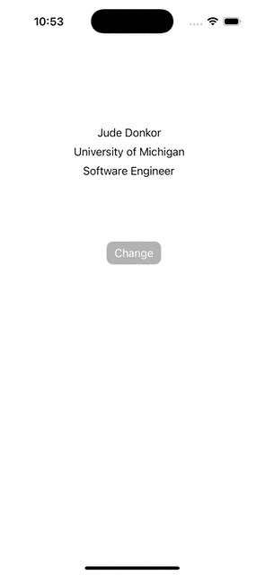

# Prework - *IosPrework*

Submitted by: **Jude Donkor**

**IOS Prework app** is an app that displays the my name, university and role. 

Time spent: **1** hours spent in total

## Required Features

The following **required** functionality is completed:

- [ ] Users are see a screen with three labels and a button
- [ ] Tapping the button changes the screen color to a random color
 
## Video Walkthrough

## App Brainstorming (Step 4)

### Application
 - Telegram : Disappearing messages, voice messages, voice calls
 - Instagram: Reels, Dms, Instagram Live
 - Youtube: Live, Shorts, Video suggesstions

## Notes

Describe any challenges encountered while building the app.
- Identifying the view controller and draging and dropping the button.

## License

    Copyright [2025] [Jude Donkor]

    Licensed under the Apache License, Version 2.0 (the "License");
    you may not use this file except in compliance with the License.
    You may obtain a copy of the License at

        http://www.apache.org/licenses/LICENSE-2.0

    Unless required by applicable law or agreed to in writing, software
    distributed under the License is distributed on an "AS IS" BASIS,
    WITHOUT WARRANTIES OR CONDITIONS OF ANY KIND, either express or implied.
    See the License for the specific language governing permissions and
    limitations under the License.
